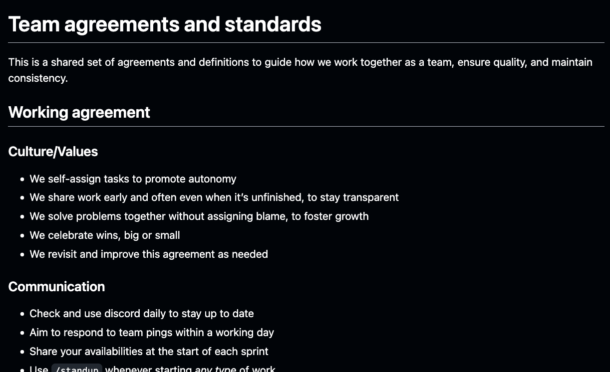
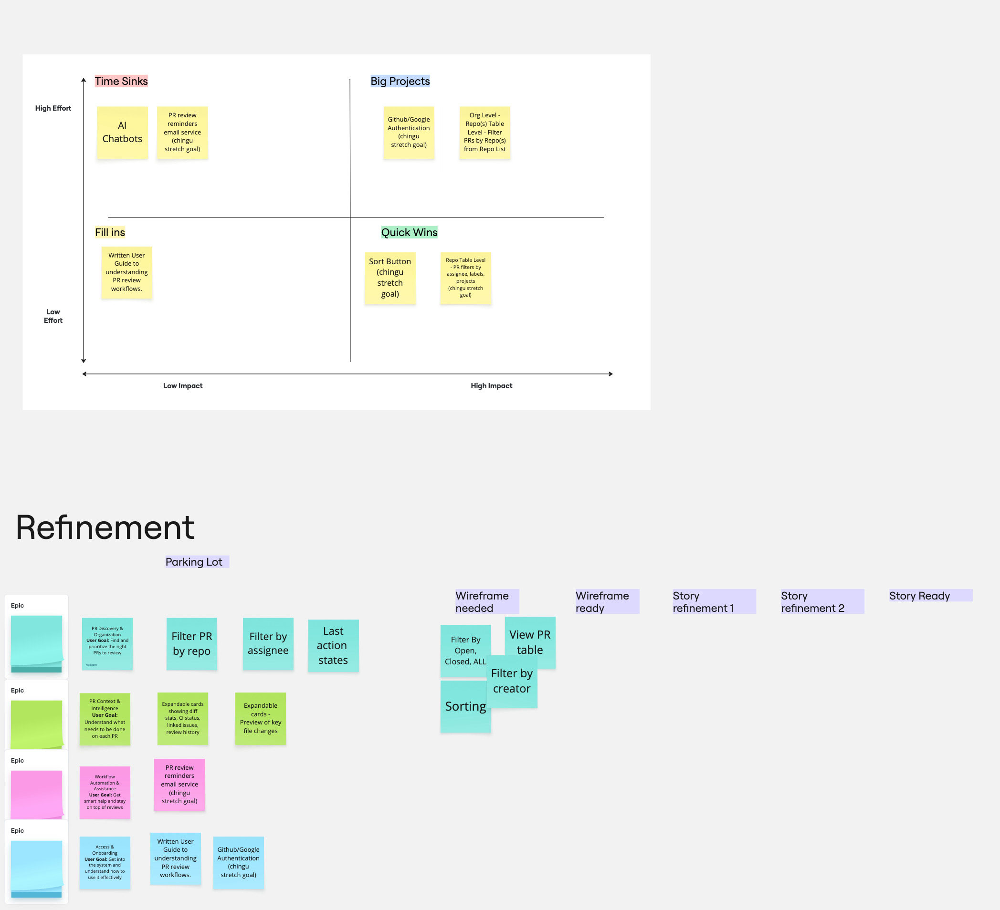
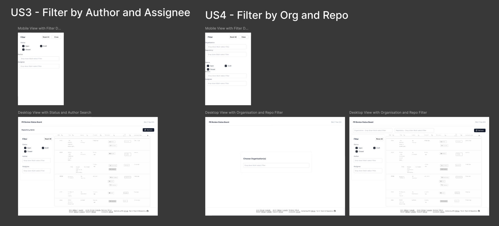
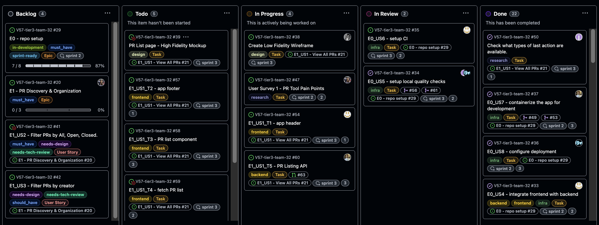
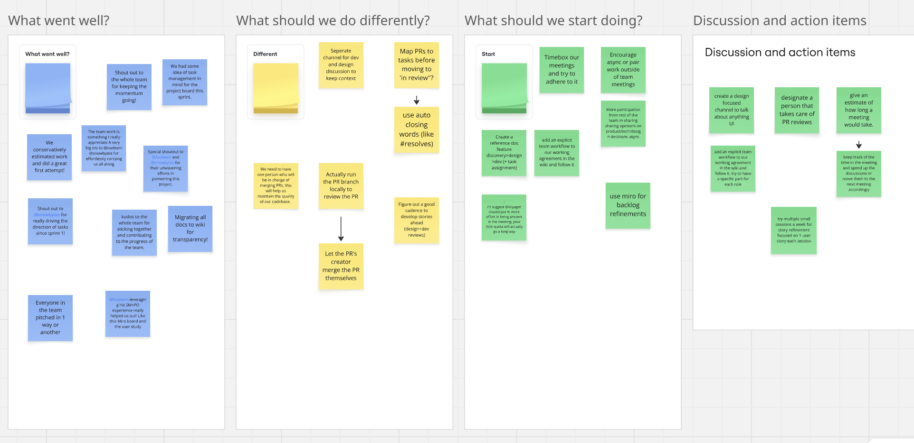

> You can find my team’s [project documentation here](https://github.com/chingu-voyages/V57-tier3-team-32/releases/tag/v1.0.0). Feel free to use it as a reference for future voyages/projects.

How do you take a bunch of strangers, scattered across the globe and turn them into a high-functioning team in just six weeks? This is the fundamental challenge of a [Chingu](https://www.chingu.io/) voyage, a 6 sprint 6 week spanning software development marathon. As a Product Manager who just completed my sixth voyage there, I've often rediscovered that success in this fast-paced, volunteer-driven environment isn't about rigid processes. It's about creating clarity, fostering ownership, and building momentum. I wanted to write this post to serve as a retrospective for myself and as a possible point of reference for those who are thinking about joining the next Chingu voyage.

Over several voyages, I've refined an approach that hinges on a few core principles:

    Clarity Over Control: My role is to ensure everyone understands the 'why' and the 'what' so they can own the 'how'.

    Co-Create, Don't Dictate: Artifacts like a Working Agreement, the product idea, and the sprint plan are all built with the team, not for them. This is shared ownership.

    Momentum is the Goal: In a six week project, the biggest risk is stagnation. Our process must aim to be lightweight, remove blockers, and celebrate weekly progress to keep energy high.

If that sounds too cookie cutter to you, here’s how I put these principles into practice.

#### Week 1: From strangers to a team

The first week is dedicated to transforming a group of individuals into a cohesive unit. Before we even discuss what to build, we focus on how we’ll work together. I schedule a kickoff meeting with a clear goal: to build psychological safety. We go beyond simple introductions to discuss our personal motivations for joining, what we hope to learn, and our real world constraints like time commitments and time zones.

While Chingu provides example projects, I’ve found that teams are most motivated when they build something that aligns with their personal goals. We run a dot-voting exercise on a digital whiteboard to brainstorm and quickly gauge enthusiasm for different ideas. A brief discussion on the top voted concepts, focused on what's realistically achievable in six weeks, helps us land on a direction we’re all excited about.

From there, we cocreate a Working Agreement. This isn't a rigid contract but a living document that answers critical questions upfront: "What's our primary chat tool?", "How do we signal when we're blocked?", "What is our process for merging code?". This simple alignment prevents most communication issues down the road.

#### Building the engine: From idea to an actionable plan

With our team foundations in place, we kick off three parallel workstreams with tight feedback loops. My first task as a PM is to draft a simple Product Brief. This one page document clarifies the product vision, the problem we're solving, our target users, and our success metrics. It becomes our north star.

Working closely with our UX designer, we begin initial discovery, including light competitive analysis, generative user research and a survey blast to potential users to validate our core assumptions. Simultaneously, the development team evaluates tech stacks and sets up their CI/CD pipeline. We bring them into the conversation immediately, sharing our initial solution hypotheses and user needs. This early collaboration is crucial; it ensures the technical architecture is built to support the desired user experience from day one.

<I>How can the team get better at agreeing on what to build?</i>

By the end of the first week, we had a validated problem statement. I translated our goals into a set of prioritised user stories for the MVP, often using the MoSCoW method to distinguish our “must haves" from our “nice to haves." At the same time, the UX designer delivered high-fidelity mockups for the core user flows. We review these as a team to ensure alignment and technical feasibility before a single line of code is written.

<i>Mocks.</i>

#### Finding a cadence: The Art of the Sprint

With a prioritised backlog and designs in hand, Monday of week two marks our first sprint planning. I guide the team through estimating their tasks, emphasising that the goal isn't to enforce deadlines but to understand complexity and surface dependencies. Once the sprint is planned, team members self-assign tasks from the GitHub project board.

<I>Discuss about about how much context is required for your team to start a task</i>

To keep the engine running smoothly, I host one or two backlog refinement sessions during the week. In these working meetings, we clarify upcoming user stories, break down larger epics, and ensure the next sprint's work is ready to go. This is also where I feed new insights from ongoing user feedback into the backlog.

We close out each week with a concise demo and retrospective. We celebrate what we shipped, discuss what went well, identify bottlenecks, and commit to one actionable improvement for the next sprint. This simple, repeatable rhythm builds momentum and creates a predictable cadence for the team to operate in.

<i>A retrospective without action is just a conversation.</i>

#### Week 6: The Real MVP is the Team

<I>Goal!</i>

In the end, the Minimum Viable Product we ship is only half the story. The real outcome of a Chingu Voyage is the team itself, a group of individuals who learned to collaborate, challenge each other respectfully, and build something meaningful together. It’s a great reminder that the best products are built not by rigid processes and red tape, but by people who are empowered and motivated by a shared goal. That is why I keep coming back.

