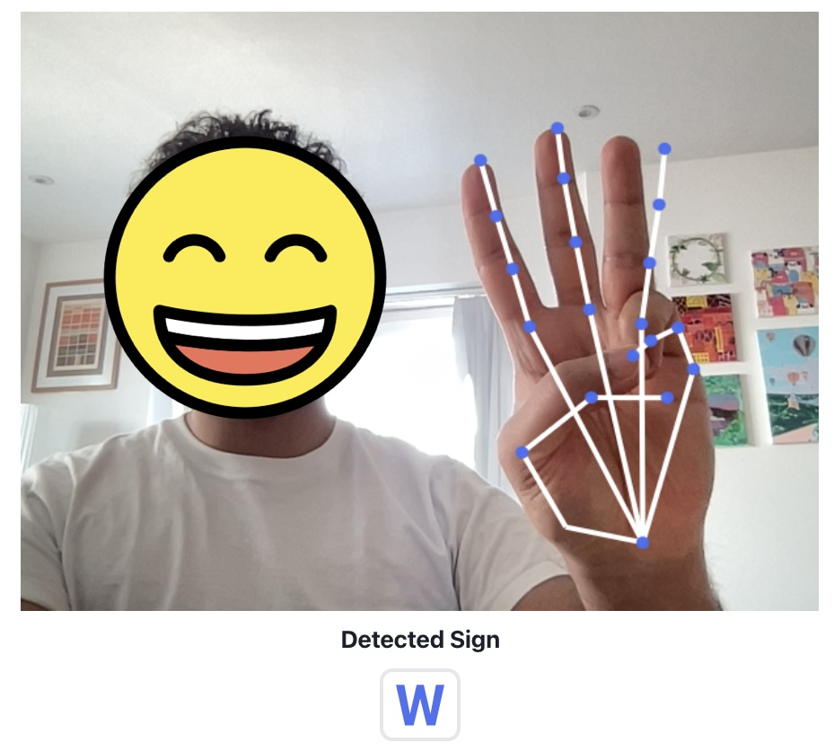

I built a web app to practice American Sign Language (ASL) alphabets in one week using a 10-year-old laptop. The app is live at [handsign.pages.dev](https://handsign.pages.dev).

This isn't a technical deep-dive but rather a summary of my experience turning a frustration into a focused MVP. It started, as all good products should, with empathy.

#### Starting with a real problem
The idea didn't come from a brainstorming session; it came from a movie I recently watched called [CODA](https://www.imdb.com/title/tt10366460/). It was about a non-deaf daughter struggling to relate to her deaf family. Her challenge highlighted a fundamental barrier: learning ASL is hard, not because the resources don't exist, but because the journey is full of friction.

My goal became a statement of intent: 
> **Make learning ASL more accessible.**
### Your user is not everyone  
At a first glance, the ecosystem around ASL is complex: instructors, learning platforms like Udemy, students, and even governments driving inclusion. To focus my effort, I prioritised stakeholders based on a set of criteria:

1. **Market Size:** Where is the largest available audience?

2. **User Need:** Which segment is most underserved?

3. **Growth Potential:** What offers long-term viability? (I noted this as a corporate concern, but less so for my immediate goal).

After reviewing some publicly available research reports, the answer was obvious: **students and learners.** They represent the largest, most underserved market with the most acute need. This is who I would build for.
  
I decided to reach out to some online ASL learning communities on discord and reddit and conducted open-ended interviews with different kinds of ASL learners (active, stalled, aspiring) to understand their learning barriers and identified three core problems:

1. **Dialect Paralysis:** Beginners don't know which dialect to start with.
2. **The Practice Gap:** It's hard to get real-time practice without being immersed in the deaf community.
3. **Time Scarcity:** Learners lack time for dedicated practice.
  

To move forward, I had to prioritise again. I assessed these problems against criteria that matter: Is the problem real? How high is the customer impact? And does solving it align with my goal of making ASL more accessible?

| **Problem**                             | **Is this a real problem?** | **Impact to the customer** | **Does it tie to my goal?** |
| --------------------------------------- | --------------------------- | -------------------------- | --------------------------- |
| **Not enough time**                     | M                           | M                          | H                           |
| **Can't find someone to practice with** | H                           | H                          | H                           |
| **Don't know which dialect to learn**   | M                           | L                          | L                           |

The problem was getting clear. **The inability to practice and get real-time feedback was the most painful and acute problem.**

  

The goal was further refined: 
> **The core problem to solve is practicing ASL with real-time feedback.**

### Building within my means

Wishes are ideas without constraints, and I had a few constraints:

* **Time:** I had just one week to build a MVP.

* **Cost:** The only hardware I had was a 10-year-old laptop with 8GB of RAM. This meant any ML models had to be CPU-reliant, not GPU-dependent.

* **Effort:** I am already familiar with web development and Machine Learning. I would have to leverage what I already knew.

With these constraints in mind, I evaluated three potential solutions supported with feedback from user surverys:

| Solution                                        | Cost/Effort | Directly impacts user problem | Unique Value/Differentiator |
| :---------------------------------------------- | :---------- | :---------------------------- | :-------------------------- |
| Anki-style memorization system                  | High        | Low                           | Low                         |
| **Camera-based Sign Recognition App**           | **High**    | **Medium**                    | **High**                    |
| Platform to connect learners with practitioners | Low         | High                          | Low                         |

The hi-fi platform would have the highest impact, but the cost and effort were too high for an MVP. The lo-fi Anki system was low effort but failed to address the core problem of *practice and feedback*.

  

### The architecture of an MVP
So I decided to build a computer vision app that runs entirely in the browser. This approach meant no downloads, no installations, and maximum accessibility. The ML model runs client-side, processing the video feed directly on the user's device.

We'll get a bit technical now. The system architecture is composed of three core components:  

1. **Component #1: Gesture Capture**

To capture hand movements via the webcam, I used a third-party react module to processes the webcam feed and output a JSON array representing the hand's position. I confirmed it worked by testing the output data type and ensuring all dependencies loaded correctly.

2. **Component #2: Hand Detection**

Interpreting the captured gestures and detecting ASL alphabet signs required comparing the incoming JSON data from the Gesture Capture module against a trained dataset of signs and ranks potential matches by a confidence score.
The initial accuracy for a few alphabets was around 30%, which I improved by focusing the training data different poses of the same alphabet. I chose to optimize for accuracy over latency, as users have a higher tolerance for slight delays than for incorrect feedback.

3. **Component #3: Flashcard Component**

Now to provide visual feedback to the user, this component takes the highest-confidence letter from the Hand Detection component, looks up the position of the hand joints, and draws a skeletal overlay and the corresponding letter on the screen. Fortunately, I found it performing adequately in low-light environments.

### Why the browser is the best first bet

I deliberately chose to build a web app and not a native mobile app. My rationale is simple:
  

* **Low Barrier to Entry:** A web app is instantly accessible. There is nothing to download. This reduces friction and speeds up the feedback loop.

* **Zero Hosting Costs:** Static file hosting on platforms like Cloudflare or Netlify is practically free.

* **Maximum Accessibility:** It works on any device with a modern browser, from a laptop to a smartphone.

I ended up choosing this tech stack for speed and efficiency:

* **React.js** for modular, extensible components, **Tensorflow.js** for client-side ML processing, **Cloudflare** for fast, cheap, and scalable static hosting.

### An MVP knows what to leave out
A critical part of building an MVP is not just deciding what to build, but deciding what *not* to build. I explicitly left some things out:

* **No User Sign-ups:** The primary goal is to validate the core mechanic. User accounts can come later.
* **No Fraud Protection:** The app runs client-side and doesn't store or record video, mitigating privacy risks from the start. For a public-facing service, I’d leverage a provider like Cloudflare for built-in CDN and privacy protection.

### Validation

The app, [handsign.pages.dev](https://handsign.pages.dev), is now live. It’s rough, but it works. I took the app back to the communities I first interviewed. The usability testing was invaluable. The app achieved roughly 70% accuracy for ASL alphabets, but the sessions revealed clear areas for improvement:
- **Improve 3D Sign Detection:** The current model struggles with signs requiring wrist rotation (like 'J' or 'Z'). The next step would be to explore a 3D model (like Tensorflow 3D), though this presents a challenge for CPU-only processing.
- **Refine the User Interface:** The UI is functional but rough. A seamless overlay for the hand-tracking graph would improve the experience, especially on mobile where the current react video library is limited.

###   What I actually learned

<i>Winning</i>

Honestly, I just wanted to build something that might help people learn ASL. I ended up with a rough app that works about 70% of the time. More importantly, I learned that asking "why this problem" and "why this solution" forces you to make better choices, even when you're just messing around on weekends.

The stuff that actually mattered:

- **Start with empathy, not tech.** A real user problem is the only testable foundation.
- **Focus on the single most painful problem.** Don't try to solve everything at once.
- **Embrace your constraints.** They are a feature, not a bug, that forces you to be creative.
- **Close the loop.** Validating with real users is the only way to know if you've built something of value.