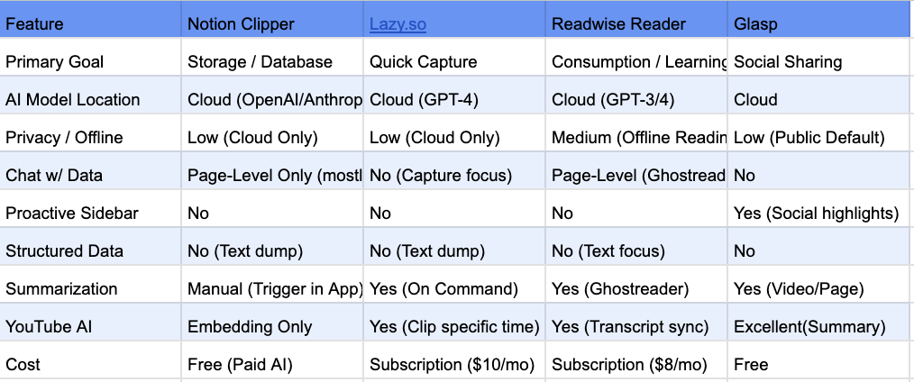
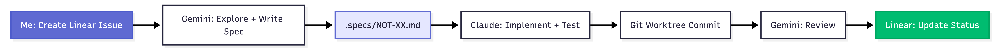
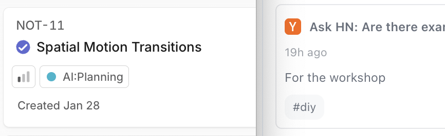
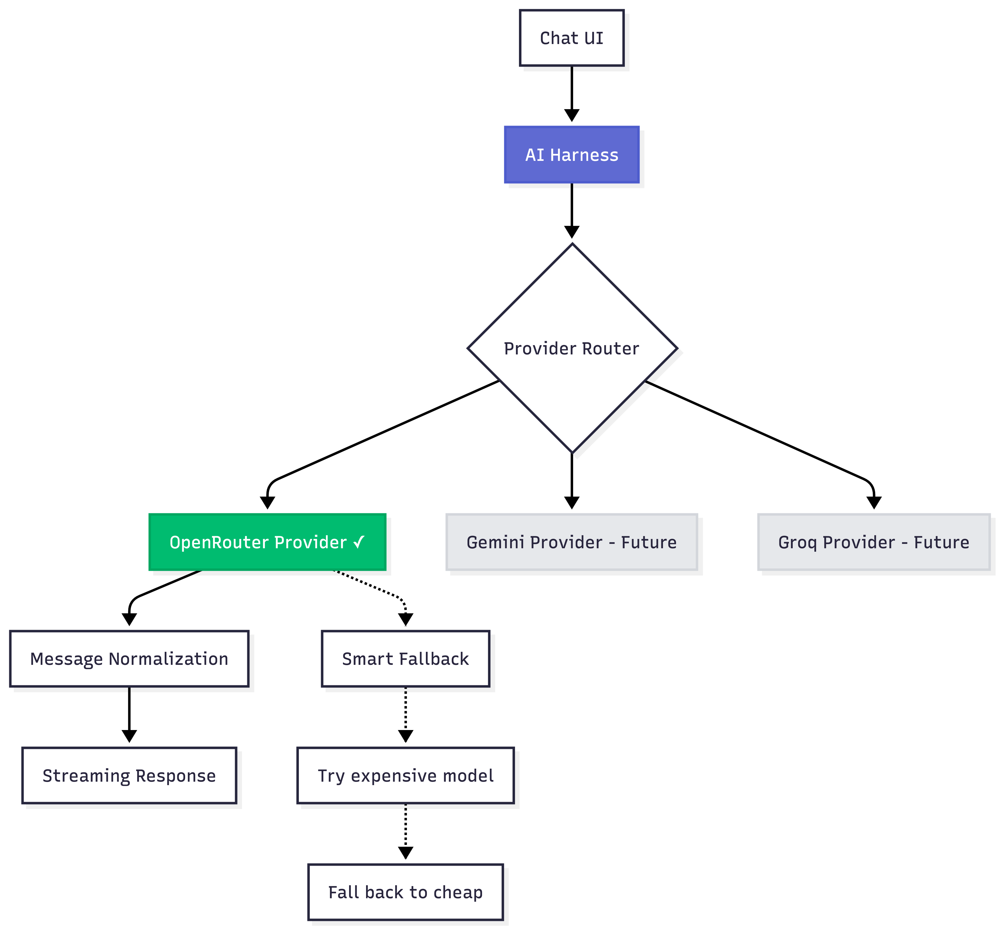
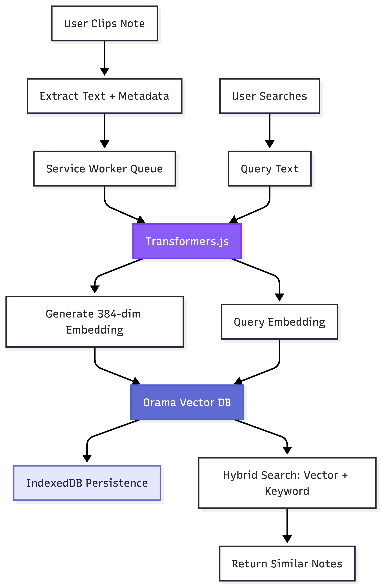
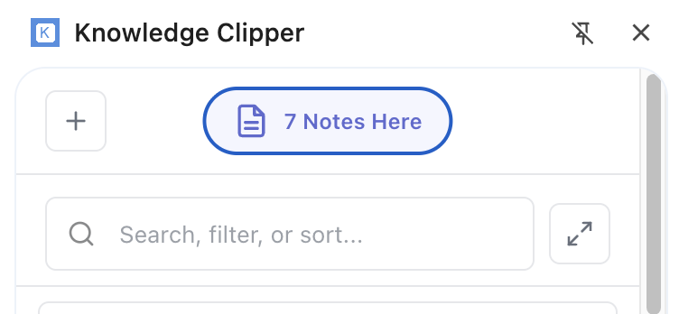
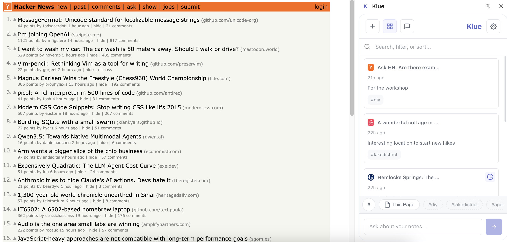
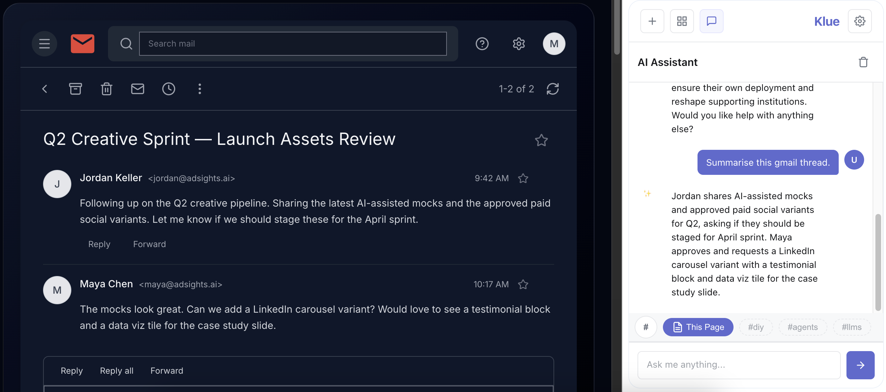

### Klue

I've been a power user for a lot of note-taking apps over the years. Joplin, Obsidian, Apple Notes, Notion, OneNote, OneTab, etc that honestly, I lost count. The pattern was always the same: save something that feels important, never see it again. Or stumble across it six months later with zero memory of why I saved it.

What bothered me wasn't the apps themselves, they're all well-built. It was the moment of friction. I'm deep into a report about UK sub-prime markets, and somewhere in my brain there's a note about 2020 sub-primes I saved months ago. But to find it means stopping everything, opening the app, guessing which tag past-me used (was it some generic like #finance? maybe specific like #primes?), scrolling through pages of stuff. By the time I find it, the connection I was chasing is gone.

Lately I'd been reading about vector search making this kind of "meaning-based" retrieval actually feasible. [Transformers.js](https://huggingface.co/docs/transformers.js/en/index) could run embedding models in the browser for years now. And LLMs don't require a PhD to set up anymore with the carnival of APIs out there. I wanted to test if I could build something that just worked so I gave myself a weekend to find out.

## Breaking Down the Problem

Before writing any code, I tried figured out who actually has this problem and what everyone else is building. Turns out, a lot.

**The Market Split**

I spent a few days prior looking at what's out there. The landscape basically splits two ways:

**Storage-focused tools** like Obsidian, Notion and Evernote let you build elaborate systems. You can customise everything, which is powerful, but I found myself spending more time organising than actually using my notes. Obsidian's [web clipper](https://obsidian.md/clipper) asks you to pick a vault, set template properties, add web page properties, all before you can save anything. It's very flexible. Also very slow when you just want to clip something quick.

**AI-native tools** like [Readwise](https://readwise.io/) get the synthesis part. Readwise's AI integration is clever. You can chat with your articles. Popular tools also now auto-summarise YouTube videos. But everything routes through cloud LLMs, which makes sense for their model but felt uncomfortable for research notes or anything work-related. Your queries, your data, all going to OpenAI's servers.

The gap I saw: Everything treats clipping like a library. You go *to* the tool to find things. Nothing proactively surfaces "hey, you have 3 notes related to what you're reading right now." The intelligence is reactive, not ambient.



**The User Personas**

I developed three archetypes, not for documentation but more like decision filters for myself that are based on my own workflows I recorded myself doing. Every time I was about to build something, I'd ask: does this actually help one of these people (or more or less state’s of me)?

**1. Deep Diver Researcher** – Academic or journalist working on long-form synthesis.
*Pain:* Loses the source of quotes. Can't find that one paragraph they swear they saved.
*The test:* Can they write a synthesis paper citing 50 pages using only this extension?

**2. Frontend Architect** – Hobby programmer researching solutions to specific bugs or implementations.
*Pain:* Saves code snippets with explanations, can't find them three months later when hitting the same bug.
*The test:* Can they solve problems from their own notes faster than re-Googling or asking AI?

**3. Avid Hiker** – Likes to build mood boards and reference hiking routes to plan for.
*Pain:* Screenshots pile up in Downloads. Pinterest is too public. Text-only clippers don't help.
*The test:* Can they design an hiking trip itinerary using only the #hiking tag?

These became the lens for every decision. Ghost tags (which we’ll cover later) shipped because the Deep Diver needed serendipity and the Hobby Programmer needed precision, it solved for both. Live context in chat shipped because all three personas needed to compose context dynamically without starting over.

## The Setup

I had a weekend to prototype so I structured my AI-Assisted workflows like a pod team, except the team was LLM agents with distinct roles:

- **Me (PM):** Making product decisions, writing specs, filtering everything through the three personas
- **`Gemini.MD` (Orchestrator and ‘Principal] Engineer' agent):** Reading Linear issues, exploring the codebase, writing technical specs to `.specs/NOT-XX.md`, reviewing code (with subagents), updating Linear issue status and with summaries
- **`Claude.MD` ('Senior Software Engineer' agent):** Reading specs, implementing with TDD, checking off boxes, committing code for review
- **Advisory skills:** `Principal Designer` persona for UX critiques (influenced by opinionated design principles), ML `Principal Engineer` persona for ML architecture advice (production patterns). I’ve set up them up to debate and come up with recommendations together.

**The Workflow:**



<br>

I contemplated using one agent for everything initially but I would have to settle for reducing my chances of one-shotting features with okay architecture and okay code. Claude is token heavy when it thinks and writes code and quickly runs out of the 5-hour usage limits. Gemini has a large 1 million token context window which is useful for managing larger thinking tasks and has forgiving usage limits. For issue management, I relied on [linear-cli](https://github.com/schpet/linear-cli) to manage Linear instead of using its own MCP which ironically consumed a lot of unnecessary tokens.


## Design System

Before building anything, I needed to answer: what outcome do I need, what should this *feel* like for the user, how do I keep the momentum of browsing the web without being intrusive?  

**Design Philosophy:**



I really liked Linear's “intent driven" philosophy: users don't "view lists," they "act on intents." So not "Bookmarks," but "Read Later." Not "Tags," but "Research Stack."

**Why It Fit the Personas:**

- **Hobby Programmer:** Keyboard shortcuts everywhere, compact UI, fast navigation
- **Deep Diver:** Dense information display, clear visual hierarchy for scanning 50+ notes
- **Avid Hiker:** Subtle animations, uninstrusive

Everything shipped with full design tokens documented in `DESIGN_SYSTEM.md` which helped made the codebase maintainable.

## Solution Architecture

### The AI Harness
The personas needed some machine learning infra to help them answer “what connects these notes?”. I evaluated three options to address this.

**Option 1: Gemini Nano (Local)**

Stable Chrome now has a built-in on-device AI. It's Privacy-first, near zero latency and completely offline after the first prompt. Sadly, it requires a minimum of 22GB storage, 16GB RAM, or 4GB VRAM GPU which my laptop barely met. The addressable market doesn't have [these specs](https://store.steampowered.com/hwsurvey/) and I can't build for hardware most people don't own.

**Option 2: Google AI APIs (Early Preview)**

Google's [preview AI APIs](https://developer.chrome.com/docs/ai/built-in-apis) (Prompt API, Summariser API, etc) looked promising and had better hardware requirements than Nano but the API surface changed weekly locking the extension into Google's ecosystem with experimental APIs meant breaking changes every month.

**Option 3: Provider Abstraction**

Having a single provider also meant a single point of failure, managing context windows between providers would also require more hacky approaches so I built an abstraction layer instead (popularly called an AI harness today) with pluggable providers. And settled on with using OpenRouter’s [free model router](https://) (stable, multi-model) for v1. This keeps the AI features free with a BYOKey feature and still kept the the door open for Gemini Nano when the ecosystem matures.

```javascript
class AIHarness {
  async initialize(providerName = 'openrouter') { }
  async sendMessage(text, context, onChunk, onComplete) { }
}
```

Providers live in `ai-harness/providers/`:
- `openrouter.js` (shipped in v1)
- `gemini.js` (placeholder for when Nano matures)
- `claude.js` (placeholder for future)

Each provider normalises messages, handles streaming, implements fallback logic. The chat UI doesn't know which provider it's talking to.

**The Payoff**



In light of AI tooling rapidly maturing in 2025, I was itching to test out another production-grade infrastructure: eval frameworks (LLM-as-a-judge for response quality), token usage tracking, concept drift monitoring, orchestration for multi-step agentic loops. But had to keep it simple because observability is for scale. You need data to observe. V1 is about validating the core loop: Can users find old notes by vague memory? Does semantic search surface useful connections? Adding instrumentation before I know what to measure felt like premature optimisation.

### Local RAG Stack

To enable active surfacing of relevant notes based on context, we couldn’t simply send the current page and note contexts to an LLM on most user actions, it’s both computationally expensive and slow. The Deep Diver researcher also can't send proprietary work to cloud LLM and Frontend Architect might be debugging internal code.


I needed a Local-first zero API calls approach for embeddings to build the engine for semantic and contextual features. It should have privacy by architecture, not by promise. Your notes should never leave your machine unless you explicitly use chat (which hits OpenRouter).


**Embedding and Clustering**
To generate sentence embeddings and tag clusters, I settled on the classic [all-MiniLM-L6-v2](https://huggingface.co/sentence-transformers/all-MiniLM-L6-v2) sentence transformer. It turns text into a numerical 'fingerprint' that represents its meaning. You can then use these fingerprints to group similar topics, find relevant information, or compare how alike two sentences are. On initial tests, larger models variants (768-dim) were more accurate but 4x bigger. Smaller models (128-dim) were faster but felt too imprecise for finding semantically similar notes. 384-dim hit the sweet spot.

**Search**
For search, I tried a simple similarity search (raw cosine similarity), but it couldn't keep up with 1,000+ notes. Then I looked into a heavy-duty tool called FAISS (via WASM), but it was just too bulky to load quickly in a browser. I discovered [Orama](https://orama.com/), which gave hybrid search (text + vector) with a tiny footprint and IndexedDB persistence out of the box which was perfect for the use case.

I implemented a queue to proces one note at a time because initial versions let embedding requests run concurrently leading the chrome service worker crashing after indexing 50 notes. The queue processes slower, but is stable for a v1.

**The Final stack:**

- **Transformers.js:** Runs `Xenova/all-MiniLM-L6-v2` in the browser (384-dimensional embeddings, 25MB model)
- **Orama:** In-memory vector database with hybrid search (keyword + semantic)
- **IndexedDB:** Persistence layer (bypasses chrome.storage's 5MB limit)
- **Service Worker:** Sequential task queue to prevent memory spikes



### UX: The Context Surfacing Problem

While setting up the backend, I was also trying to address the core UX problem: How do users tell the app what context to use? Took a few tries to get this right.

**Iteration 1: Context Pills**

First attempt had fragmented context management. Header pill showed "Related Notes," dropdown hiding Tag filters, chat having no explicit context control. Users couldn't compose specific context like "analyse *This Page* + *#research* notes."



Context is a state, not decoration. I needed to show it structurally, not visually. Seeing context as decorative chips scattered around wasn't helping users understand what was "in scope."


**Iteration 2: Stack Unification**

I killed the header pill and moved everything into "Stack” chips, a single source of truth for context. I used semantic search for suggestion pills instead. When viewing a page with no saved notes, we extract the page's title and text, generate embeddings, query vector DB for similar notes and then pull *their* tags.

The strategy:
- Stack = one state driving both Library filtering AND chat context
- Chips for everything: "This Page," `#tags`, "Starred," "Read Later"
- AND logic: Stack filters + Search
- Live context: Changing filters updates the next chat message, doesn't reset the conversation

Users today treat classic chat UIs as a workspace. They want to bring new tools into the conversation, not start over. It felt right when I tested it. Changing a filter mid-conversation should refine what you're asking about, not throw away the whole thread.


**Iteration 3: Stack Context Bar**

I refined the stack with a fixed ‘This Page’ button, a new pop up context menu for more filters and sorting and a scrollable horizontal bar. The tags appear as light grey chips in the Stack. Click one, becomes an active filter, surfaces the related notes you forgot you had. The idea is also applied to search. If Stack is active and search returns nothing, we show a helper: *"Searching in context. Search all notes?"* One click clears Stack filters but keeps the search term.


The stack appears in both Library view and Chat view with the same state in both locations. Toggle a tag in Library, it instantly appears in Chat. Toggle "This Page" in Chat, Library filters immediately.


## What Shipped

Shipped v1.0.0 to [Chrome Web Store](https://chromewebstore.google.com/detail/klue/cackjmmgcmnkjnffabkabapdkofggpjl?authuser=0&hl=en) over the weekend.

**Core Features:**
- Chrome side panel with Library + Chat views
- Semantic search: vector embeddings, hybrid with keyword search via Orama
- Basic Note creation and editing tools
- AI chat with smart context injection (Stack filters + "This Page" content)
- Smart metadata extraction (title, description, auto-tags from content)
- Ghost tags (semantic suggestions from similar notes)
- Linear-inspired design system (color tokens, spacing scales, full motion system)
- Privacy-first architecture (local embeddings, only chat hits OpenRouter)





<br>

**Is it perfect?** No. The image handling is basic (saves them, but no gallery view yet). The "This Page" filter sometimes gets confused on sites with complex edge case URL parameters. Ghost tags occasionally suggest connections that make zero sense and require fine tuning. But the core loop works: I can find that 2020 sub-primes note by typing “loans" into search. That's the thing I needed to work.

**The Tests:**

Deep Diver: Can cite old notes without remembering exact keywords. ✓

Hobby Programer Architect: Solves problems from personal solution library faster than re-Googling. ✓

Avid Hiker: Images and meta data save, but no gallery view and limited use of metadata. Partial. Maybe v1.1.

I've been using it daily since shipping. That's the real test for me.

## What’s next?

A product shipped doesn't mean product launched. I still want to convince people to try this and bring their challenges. There’s more feedback to be captured from real users and testing to refine the experience. The first three personas were educated guesses. Now I'll have actual data.

If you found what I’m trying to build interesting, give Klue a try [on the Chrome Web Store](https://chromewebstore.google.com/detail/klue/cackjmmgcmnkjnffabkabapdkofggpjl). 
